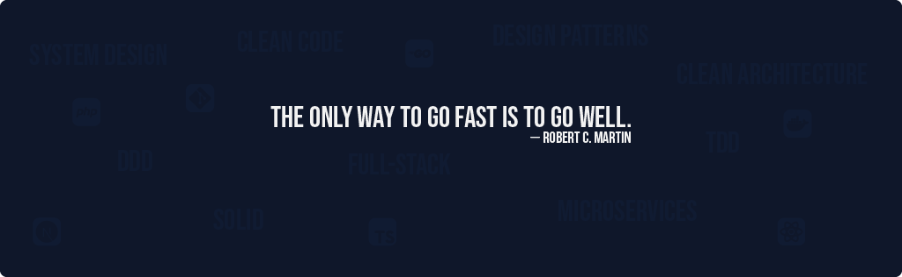
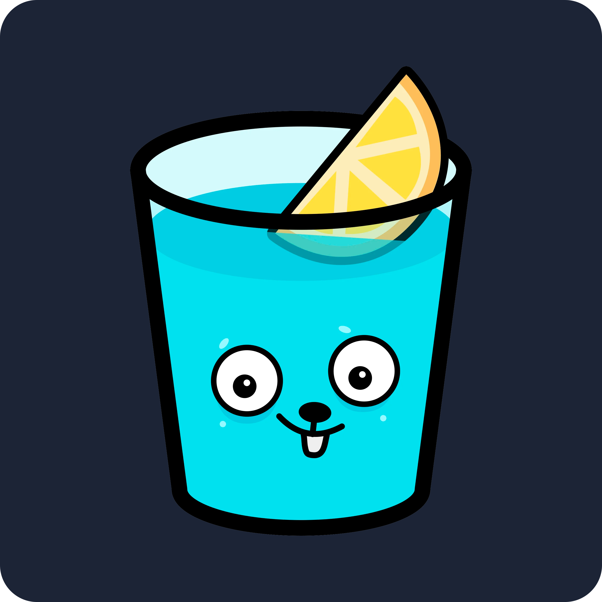

<svg fill="none" viewBox="0 0 100% 100%" width="100%" height="2000" xmlns="http://www.w3.org/2000/svg">
  <foreignObject width="100%" height="100%">
    

      

        
        Hi! My name is Yan Doro
        > Full-stack Engineer | Go | TypeScript | PHP | ReactJs
        <table height="100vh">
          <tr>
            <td width="70%">
              <h3 align="left">About Me</h3>
              

                I've been working as a full-stack developer since 2018. Throughout my journey, I've worked with a wide
                range of programming languages, from Rust to Clipper, as well as more common ones like Python, Ruby,
                Elixir, and Java. The only constants in my career have been Node.js and React, but I see languages and
                frameworks as just tools to solve problems.
              

               
              

                

                  
                  &nbsp;
                  Developer Since 2018
                

                

                  
                  &nbsp;
                  Project Management Postgraduated
                

                

                  
                  &nbsp;
                  Rio de Janeiro, Brasil
                

              

            </td>
            <td>
              <h3 align="right">Socials & Contact</h3>
              

                
                
                
              

              <h3 align="right">Support Me</h3>
              
            </td>
          </tr>
        </table>
        <h2>Skills</h2>
        

          

            <h3>Top Languages</h3>
            
            
            
            
            
          

          

            <h3>Databases</h3>
            
            
            
            
          

          

            <h3>Frameworks</h3>
            
            
            
            
            
            ...
          

          

            <h3>Front-end</h3>
            
            
            
            
            
            
          

          

            <h3>Tools</h3>
            
            
            
            
            
            ...
          

        

        <h2>Badges</h2>
        

          
          
        

      

    

  </foreignObject>
</svg>
